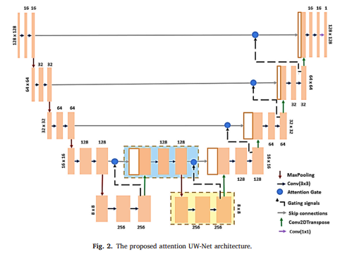
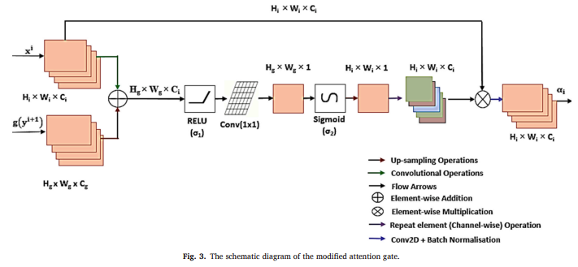
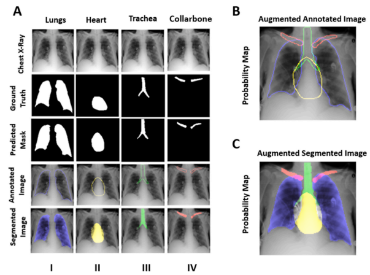
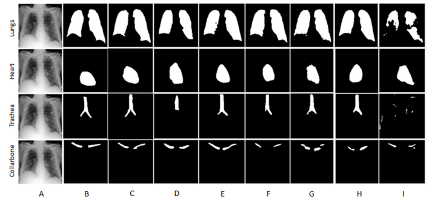
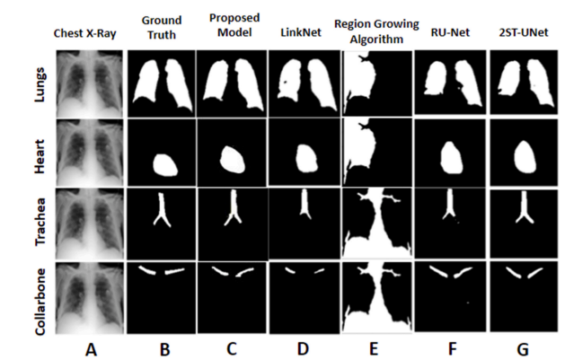

# Attention UW-Net
A Novel Attention U-Net architecture for the automatic segmentation and annotation of 2D Chest X-Ray Images.
To link to the actual paper can be found at [link](https://www.sciencedirect.com/science/article/abs/pii/S0010482522007910)
### Content:
* [Requirements](#re2q)
* [Datasets](#datasets)
* [Method](#method)
* [Results](#results)
* [Code](#code)

#### <a name='reqs'> Requirements</a>:
* Python 3.7.10
* Sklearn
* Tensorflow
* Matplotlib

#### <a name="datasets"> Datasets </a>:
test_image.rar consists of 50 Chest X-Ray (CXR) images. test_data.rar consists of the corresponding masks (lungs, heart, trachea and collarbone)

#### <a name="method"> Method </a>:



#### <a name='results'> Results </a>:




#### <a name='code'> Code</a>:
The .ipnyb file (Attention UW_Net.ipnyb) is the python code for the Attention UW-Net. 

#### <a name='Citation'> Code</a>:
```
Pal, D., Reddy, P. B., & Roy, S. (2022). Attention UW-Net: A fully connected model for automatic segmentation and annotation of chest X-ray. Computers in Biology and Medicine, 150, 106083.
```
